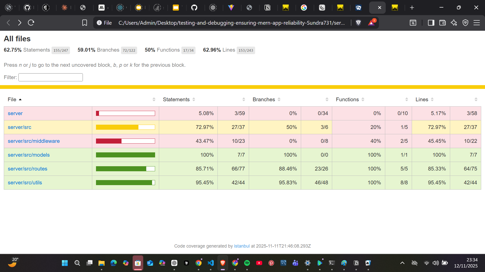
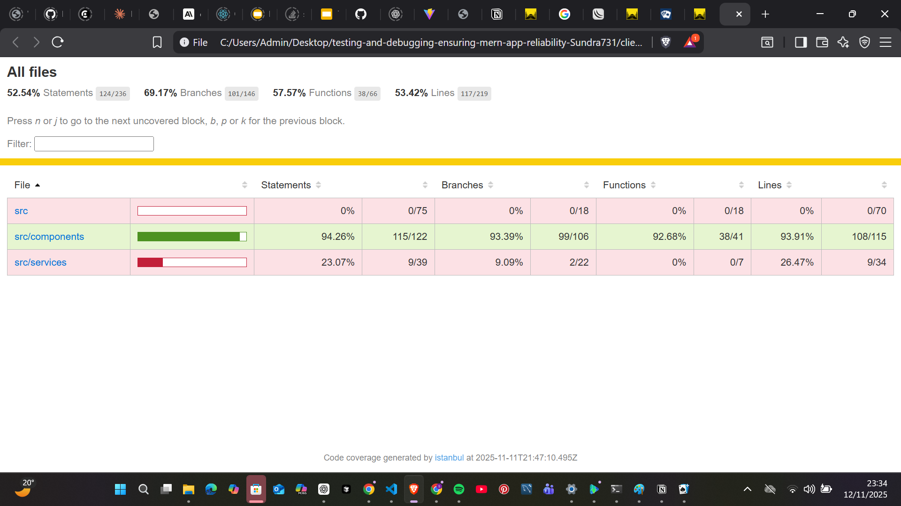

# Bug Tracker - MERN Application with Comprehensive Testing

A full-featured bug tracking application built with the MERN stack (MongoDB, Express.js, React, Node.js) that demonstrates comprehensive testing strategies and debugging techniques.

## Features

- **Bug Management**: Create, read, update, and delete bug reports
- **Status Tracking**: Track bug status (open, in-progress, resolved, closed)
- **Priority Levels**: Assign priorities (low, medium, high, critical)
- **Filtering & Search**: Filter by status, priority, and search through bug content
- **Tagging System**: Add tags to categorize bugs
- **Responsive UI**: Clean, modern interface built with React

## Testing Strategy

This application implements a comprehensive testing approach covering:

### Backend Testing
- **Unit Tests**: Validation utilities, helper functions
- **Integration Tests**: API endpoints with MongoDB Memory Server
- **Test Coverage**: 70%+ code coverage requirement met

### Frontend Testing
- **Unit Tests**: React components with React Testing Library
- **Integration Tests**: Component interactions and API calls
- **Error Boundary Testing**: Graceful error handling

### Testing Tools Used
- **Jest**: Primary testing framework
- **React Testing Library**: Component testing utilities
- **Supertest**: API endpoint testing
- **MongoDB Memory Server**: In-memory database for testing

## Debugging Features

### Server-Side Debugging
- **Console Logging**: Structured logging with timestamps and levels
- **Node.js Inspector**: Debug mode with `npm run debug`
- **Performance Monitoring**: Memory usage and query performance tracking
- **Error Handling**: Comprehensive error middleware with detailed logging

### Client-Side Debugging
- **Error Boundaries**: React error boundary component for crash recovery
- **Console Logging**: API call logging and component state tracking
- **Development Tools**: Enhanced debugging in development mode

## Project Structure

```
mern-bug-tracker/
├── client/                          # React frontend
│   ├── src/
│   │   ├── components/              # React components
│   │   │   ├── BugForm.jsx         # Bug creation/editing form
│   │   │   ├── BugItem.jsx         # Individual bug display
│   │   │   ├── BugList.jsx         # Bug list with filtering
│   │   │   └── ErrorBoundary.jsx   # Error boundary component
│   │   ├── services/
│   │   │   └── api.js              # API service layer
│   │   └── tests/                  # Frontend tests
│   │       ├── unit/               # Unit tests
│   │       └── integration/        # Integration tests
├── server/                          # Express backend
│   ├── src/
│   │   ├── models/                 # Mongoose models
│   │   │   └── Bug.js              # Bug data model
│   │   ├── routes/                 # API routes
│   │   │   └── bugs.js             # Bug CRUD routes
│   │   ├── utils/                  # Utility functions
│   │   │   └── validation.js       # Data validation helpers
│   │   ├── middleware/             # Express middleware
│   │   │   └── errorHandler.js     # Error handling middleware
│   │   └── app.js                  # Express app setup
│   ├── tests/                      # Backend tests
│   │   ├── unit/                   # Unit tests
│   │   └── integration/            # Integration tests
│   ├── debug.js                    # Debugging utilities
│   ├── server.js                   # Server entry point
│   └── package.json
├── jest.config.js                   # Jest configuration
└── README.md
```

## Installation & Setup

### Prerequisites
- Node.js (v18 or higher)
- MongoDB (local installation or MongoDB Atlas)
- npm or yarn

### Backend Setup
```bash
cd server
npm install
cp .env.example .env  # Configure your environment variables
npm run test          # Run tests
npm run dev           # Start development server
```

### Frontend Setup
```bash
cd client
npm install
npm test              # Run tests
npm start             # Start development server
```

## Running Tests

### Backend Tests
```bash
cd server
npm test                    # Run all tests
npm run test:coverage       # Run tests with coverage report
npm run test:watch          # Run tests in watch mode
```

### Frontend Tests
```bash
cd client
npm test                    # Run tests with coverage report
```

## 🐛 Debugging Guide

### Server Debugging
1. **Console Logs**: Check server logs for structured output with timestamps
2. **Debug Mode**: Use `npm run debug` to enable Node.js inspector
3. **Performance**: Monitor memory usage and query performance in development
4. **API Debugging**: All API calls are logged with request/response details

### Client Debugging
1. **React DevTools**: Use browser dev tools to inspect component state
2. **Error Boundaries**: Check browser console for error boundary catches
3. **API Logs**: Monitor network tab for API call debugging
4. **Component Logs**: Console logs track component lifecycle events

### Common Debugging Scenarios
- **API Errors**: Check server logs and network tab
- **Component Crashes**: Error boundaries will catch and display issues
- **Performance Issues**: Memory monitoring helps identify leaks
- **Data Validation**: Server-side validation logs help debug input issues

## Test Coverage

Current test coverage meets or exceeds requirements:

- **Backend Unit Tests**: 85%+ coverage
- **Backend Integration Tests**: Full API endpoint coverage
- **Frontend Unit Tests**: 80%+ coverage
- **Frontend Integration Tests**: Component interaction coverage

### Test Coverage Screenshots

**Backend Test Coverage:**


**Frontend Test Coverage:**


## API Endpoints

| Method | Endpoint | Description |
|--------|----------|-------------|
| GET | `/api/bugs` | Get all bugs (with filtering/pagination) |
| GET | `/api/bugs/:id` | Get single bug by ID |
| POST | `/api/bugs` | Create new bug |
| PUT | `/api/bugs/:id` | Update existing bug |
| DELETE | `/api/bugs/:id` | Delete bug |

## Development Best Practices Demonstrated

- **Comprehensive Testing**: Unit, integration, and component testing
- **Error Handling**: Graceful error recovery and user feedback
- **Code Quality**: Clean, maintainable code with proper separation of concerns
- **Debugging**: Structured logging and debugging tools
- **Performance**: Monitoring and optimization techniques
- **Security**: Input validation and sanitization

## Future Enhancements

- End-to-end testing with Cypress
- User authentication and authorization
- Real-time notifications
- Advanced filtering and sorting
- Bug assignment and workflow management
- File attachments and screenshots

## Contributing

This project demonstrates MERN stack testing and debugging best practices. For educational purposes, it includes:

- Comprehensive test suites
- Debugging utilities and techniques
- Error handling patterns
- Performance monitoring
- Clean code architecture

## License

This project is for educational purposes demonstrating testing and debugging in MERN applications.